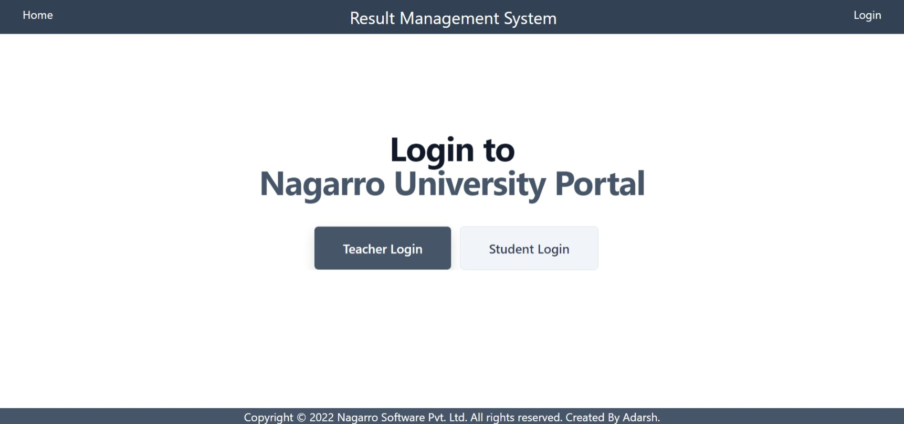

# Result-Management-Application
A Result Management System using HTML, CSS, JavaScript , Node and using MVC Model. 
• Two types of users can login to application by clicking a button on homepage. 
• Students can enter their roll number and date of birth to view their result. 
• Teachers can View all records, add new record, edit and delete the records. 

## Dependencies

- [Node.js](https://nodejs.org/)
- [Express.js](https://expressjs.com/)
- [EJS](https://ejs.co/)
- [Tailwind CSS](https://tailwindcss.com/)

# Requirements

You need to have installed [Node.js](https://nodejs.org/es/download/).

# Setup Guide 

## Database 
1. Signin/up to [MongoDB Atlas](https://www.mongodb.com/cloud/atlas).
2. Create a cluster and connect it to your application.
 

  
## Backend 
1. Open the project in Visual Studio Code.
2. Go to toolbar --> terminal --> Open new terminal.
3. Run command "npm install" and "npm install -g nodemon" to install all dependencies and NodeMon .
4. Now to Build the project by command "npm run build" on terminal.
5.Run the project by Run command "npm start" on terminal.
#### Teacher/Admin Credentials
- Email : admin@test.com
- Password : admin123
  
## Frontend
1. Open URL "https://localhost:3000" on a browser.

# Screen-Shots 

## Project Structure

## HomePage 

## Login Page 

## Teacher Login 

## Teacher Dashboard

## Add student result

## Update student result

## Student Dashboard

## Student Marksheet
